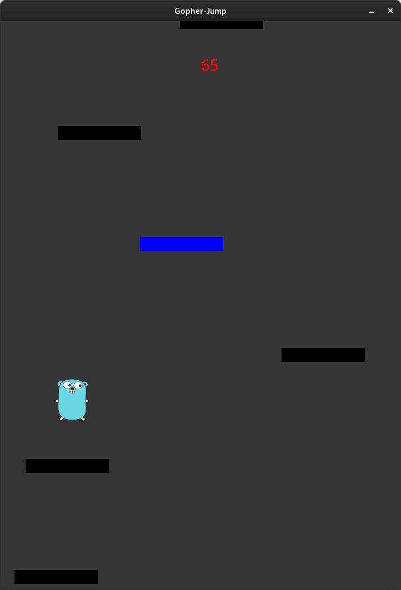

# Gopher-Jump

I started this project when I was learning Golang and later returned to finish it.  
This project uses GTK with bindings provided by [gotk4](https://github.com/diamondburned/gotk4) for the GUI stuff.
I wanted to write as much as possible from scratch without libraries.
So aside from gotk4 this project has no, and will not get any other dependencies.

  

